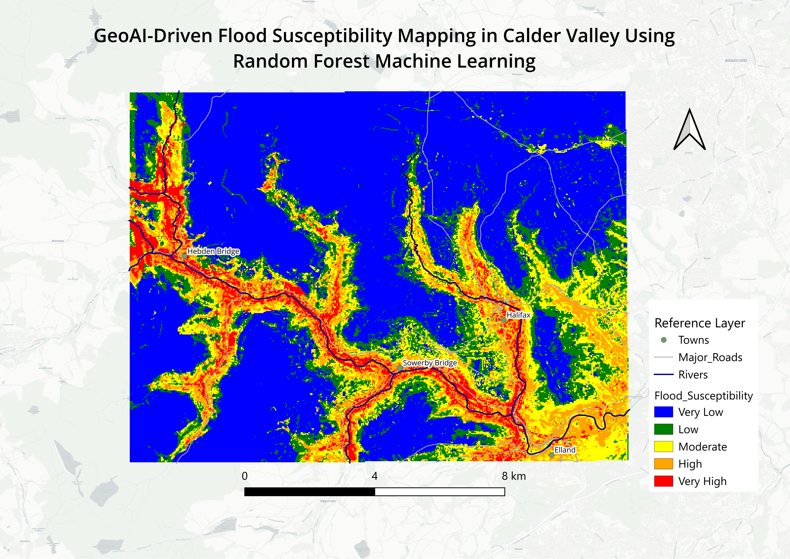
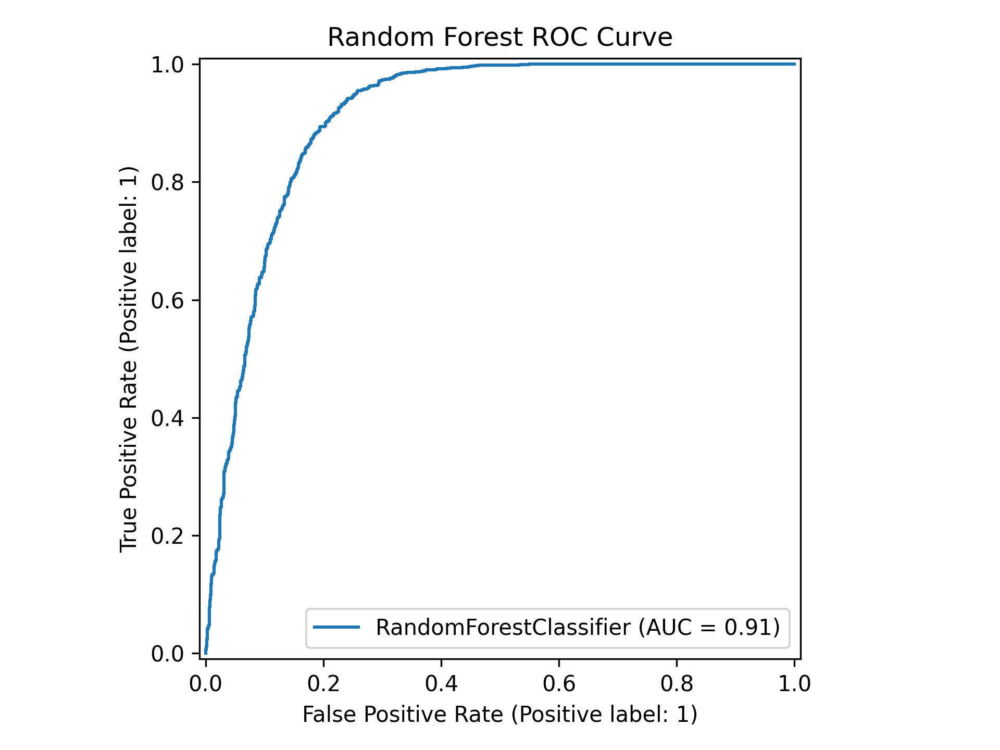
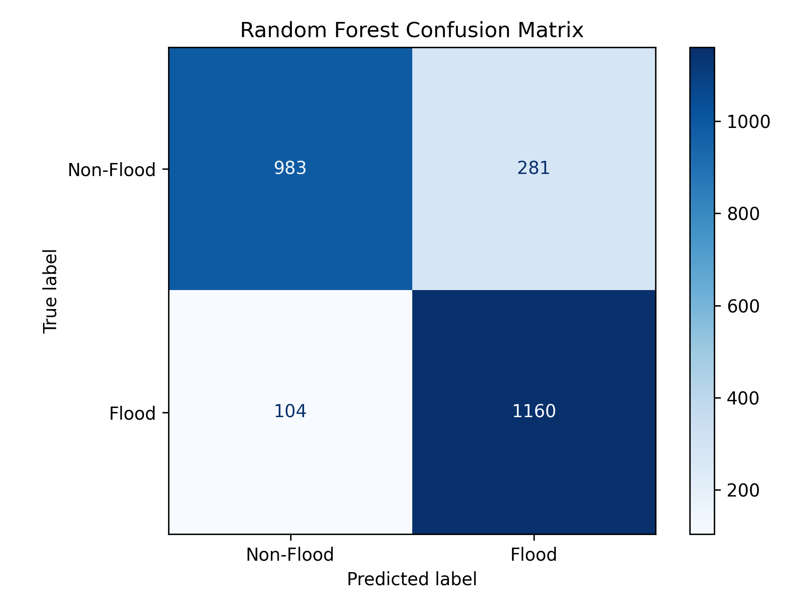
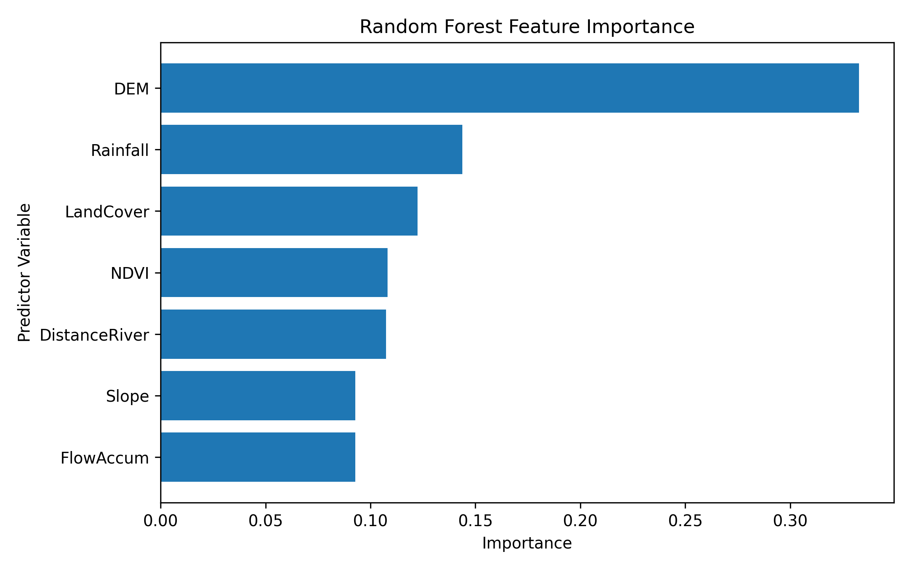

# GeoAI Flood Susceptibility Mapping in Calder Valley

## Overview

This project applies Random Forest Machine Learning, GIS, Remote Sensing, and Python to assess flood susceptibility across Calder Valley, West Yorkshire, United Kingdom.

## Project Objectives

* Develop a machine learning-based flood susceptibility model.
* Integrate GIS, Earth Observation, and hydrological datasets.
* Compare data-driven modelling approaches with traditional GIS overlay methods.
* Produce a flood susceptibility map to support flood risk assessment and climate resilience planning.

## Software and Tools

* QGIS
* Python
* Google Earth Engine
* GeoPandas
* Rasterio
* NumPy
* Scikit-learn
* Matplotlib

## Data Sources

* Copernicus DEM
* Sentinel-2 NDVI
* ERA5 Rainfall Data
* Land Cover Data
* River Network Data

## Methodology

1. Preparation of Digital Elevation Model (DEM) and hydrological variables.
2. Derivation of environmental predictors including slope, flow accumulation, rainfall, land cover, NDVI, and distance to river.
3. Creation of flood and non-flood training samples.
4. Random Forest model training and validation.
5. Flood susceptibility prediction across the study area.
6. Classification of susceptibility into five categories from Very Low to Very High.

## Model Performance

* Accuracy: 84.8%
* ROC-AUC: 0.91
* Flood Recall: 92%

## Visual Outputs

* Flood Susceptibility Map
* ROC Curve
* Confusion Matrix
* Feature Importance Analysis

## Key Findings

The model successfully identified high-susceptibility corridors that closely follow the Calder Valley river network. Results demonstrate the effectiveness of machine learning in capturing complex relationships between terrain, hydrology, vegetation, and rainfall compared with traditional weighted-overlay approaches.

## Repository Structure

* docs/ – Project documentation
* maps/ – Final maps and visual outputs
* scripts/ – Python scripts
* outputs/ – Model outputs and figures

## Flood Susceptibility Map

## ROC Curve

## Confusion Matrix

## Feature Importance

## Author

**Onyekachi Orji**

Climate & Environmental Geospatial Intelligence Specialist | Surveying | GIS | Remote Sensing | GeoAI | Python
